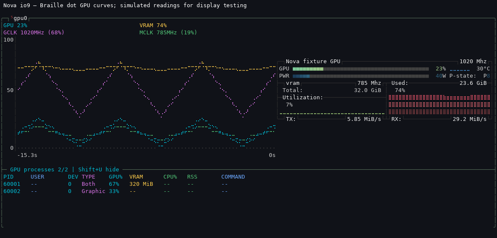

# Nova btop

A Linux fork of [aristocratos/btop](https://github.com/aristocratos/btop), based
on upstream v1.3.0. Current Nova version: **1.3.0-nova-io10**.

## AI disclosure and release privacy

**[AI generated]** Nova modifications, tests, packaging and documentation
include AI-generated content. Validation is described below; this disclosure
does not imply that upstream btop code was AI-generated. Any contribution back
to upstream must follow its current contributing guidelines.

Release defaults are generic. Packages exclude local profiles, usernames,
hostnames, private contact details, mount labels and runtime logs. The bundled
preview uses simulated data. Public repository links and required upstream
contributor/licence attribution remain. Run `python3 audit_release.py` to inspect
the built archives before upload.

## Added displays

- Mounted disks retain capacity/usage alongside live read and write MiB/s and
  separate histories. Rates use measured elapsed time between kernel samples.
- Optional logical processor histories, with a single-graph fallback when the
  window cannot fit every processor.
- A persistent GPU panel with four coloured Braille dot curves: GPU load,
  allocated VRAM, graphics clock and memory clock. Each character contains
  two horizontal points and four vertical dot levels.
- A NVIDIA GPU process summary beneath the graph: graphics/compute clients,
  GPU activity, VRAM and available host process information.
- A coloured duf-style mount table across the bottom, including filesystem,
  device, capacity, used/available bytes and percentage.
- An optional zram compression summary under RAM. Idle swap headers do not
  keep it visible; it returns automatically when real swap pages are used.



The preview uses simulated driver readings. Hardware GPU values require a
working driver and its monitoring library. The NVIDIA process summary uses
optional NVML APIs; missing values remain `--`. A compatible terminal font
must include Braille glyphs. ASCII dot fallback is available in TTY mode.

## Download and install

Download the versioned files from
[GitHub Releases](https://github.com/kuchida75/btop-nova/releases).
The supplied binary targets **Linux x86-64**, with dynamically loaded GPU
support. It requires **glibc 2.38 or newer** and **libstdc++ providing
GLIBCXX_3.4.32**. The `.deb` records the precise dependencies calculated from
the binary. It was built/tested on Ubuntu 26.04.1; other distributions should
check these dependencies or build from source. No GPU driver is bundled.

Verify downloads against `SHA256SUMS` before extraction/installation:

```sh
sha256sum --ignore-missing -c SHA256SUMS
```

### Portable user installation (recommended on the existing Nova host)

```sh
tar -xzf btop-nova-1.3.0-nova-io10-linux-amd64.tar.gz
cd btop-nova-1.3.0-nova-io10-linux-amd64
python3 install_nova.py
~/.local/bin/btop
```

Close the existing btop before updating. This updates the isolated Nova user
installation and keeps your existing preferences. Fresh installations use
portable defaults that discover local disks and network interfaces. It also
adds a marked Bash alias for `btop`; open a new Bash terminal to use the alias.
The packaged `/usr/bin/btop` and `~/.config/btop` are preserved.

Nova configuration: `~/.local/share/btop-nova/config/btop/btop.conf`.
Old versioned binaries remain available under `~/.local/share/btop-nova/releases`.

To remove the Nova user command/alias while retaining its data:

```sh
python3 rollback_nova.py
```

Open a new terminal afterward, or use `unalias btop; hash -r` in the current
Bash session. `/usr/bin/btop` remains available throughout.

### Ubuntu/Debian package

```sh
sudo apt install ./btop-nova_1.3.0+nova.io9-1_amd64.deb
btop-nova
```

The package supplies the separate `btop-nova` command. It does not replace
`/usr/bin/btop`, add shell aliases or modify drivers, swap or the AI stack.
It has no maintainer scripts. Its independent profile lives at
`${XDG_CONFIG_HOME:-~/.config}/btop-nova/btop/btop.conf`, so it does not import
the existing Nova user-install profile automatically. To uninstall:

```sh
sudo apt remove btop-nova
```

## Controls

| Key | Nova option |
| --- | --- |
| Shift+L | Logical processor grid / aggregate CPU |
| Shift+N | Coloured GPU dot histories / previous GPU graph |
| Shift+V | Independent GPU load and VRAM histogram |
| Shift+U | Show/hide the GPU process summary |
| Shift+M | Show/hide the mounted-filesystem table |
| Shift+B | Include/hide boot and EFI disk cards |
| Shift+Z | Enable/disable the automatic zram summary |
| i | Normal disk cards / optional I/O-only view |

The same preferences are available in Options and persist. The Nova layout
allocates more GPU height, keeps top processes visible and hides swap display
initially. Zram stays hidden when unused or too little space is available.
Small panels fall back automatically; enlarging restores enabled views.
Disk throughput is block-device I/O, so cached reads and delayed writes can
differ from application copy speeds. Zram `RAM` includes allocator overhead;
`Save` is original data minus that actual RAM cost, and can be negative.

## Build and package

A C++20 compiler and GNU Make are required. On Linux x86-64 the Make build
enables GPU support by default. Do not use a fully static build if you want
dynamically loaded GPU monitoring.

```sh
make -j2 QUIET=true
sh ./launch-nova-btop
python3 package_nova.py
```

Package creation additionally needs Python 3, `dpkg-deb` and `dpkg-shlibdeps`.
It writes a portable binary archive, `.deb`, source archive, machine-readable
manifest and checksums into `dist/`. `--output DIR` selects another directory;
`--source-ref REF` selects a committed source revision. The package build
requires clean committed code so the source archive matches the binary build.

`python3 test_package.py` validates metadata, extracted commands, fresh and
existing profiles, themes, rollback and file preservation without installing
the `.deb` or writing outside a temporary test directory.

See [NOVA.txt](NOVA.txt) for display details and prior validation. The release
retains Apache-2.0 upstream attribution and the bundled library notices.
